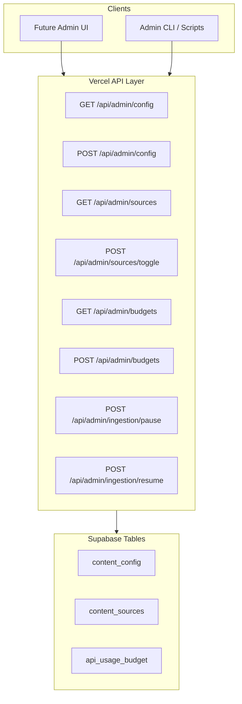

# Phase 8: Admin Config API Implementation

## Architecture Overview



## Authentication Strategy

Reuse the existing admin secret pattern from [`api/admin/publish-gist-v3.ts`](api/admin/publish-gist-v3.ts):

- **Header**: `x-admin-secret` must match `ADMIN_SECRET` env var
- **DB Access**: Use service role key for database mutations
- **Logging**: All mutations logged with timestamp and action details
```typescript
// Shared auth helper pattern (lines 39-51 from publish-gist-v3.ts)
if (adminSecret) {
  const requestSecret = req.headers['x-admin-secret'];
  if (!requestSecret || requestSecret !== adminSecret) {
    return res.status(401).json({ error: 'Unauthorized' });
  }
}
```


## API Endpoints

### 1. Configuration Management

**GET `/api/admin/config`** — Read all or specific config entries

- Query param: `?key=ingestion.enabled` (optional, returns all if omitted)
- Returns: `{ configs: ContentConfigEntry[] }`

**POST `/api/admin/config`** — Update config value

- Body: `{ key: string, value: any, description?: string }`
- Validates key exists before update
- Returns updated config with `updated_at`

**Supported config keys**:

| Key | Type | Description |

|-----|------|-------------|

| `ingestion.enabled` | boolean | Global ingestion pause/resume |

| `ingestion.max_items_per_run` | number | Max items per ingestion run |

| `ingestion.refresh_interval_minutes` | number | Stored interval (no scheduler wiring) |

| `sports.enabled` | boolean | Sports content toggle |

| `sports.leagues` | string[] | Active sports leagues |

### 2. Content Source Control

**GET `/api/admin/sources`** — List all content sources with status

- Returns: `{ sources: ContentSourceRecord[] }`

**POST `/api/admin/sources/toggle`** — Enable/disable a source

- Body: `{ source_key: string, is_active: boolean }`
- Validates source exists before update
- Returns updated source record

**POST `/api/admin/sources/config`** — Update source-specific config

- Body: `{ source_key: string, config: object, rate_limit_per_hour?: number }`
- Merges with existing config (no destructive overwrites)
- Returns updated source record

### 3. API Budget Management

**GET `/api/admin/budgets`** — View current budget usage

- Query param: `?source_key=newsapi-rapidapi` (optional)
- Returns: `{ budgets: ApiUsageBudgetRecord[] }` with current period stats

**POST `/api/admin/budgets`** — Set budget limit for a source

- Body: `{ source_key: string, daily_limit: number }`
- Creates or updates budget for current period
- Returns updated budget record

### 4. Ingestion Control (Convenience Endpoints)

**POST `/api/admin/ingestion/pause`** — Pause all ingestion

- Sets `ingestion.enabled = false` in `content_config`
- Returns: `{ success: true, ingestion_enabled: false }`

**POST `/api/admin/ingestion/resume`** — Resume ingestion

- Sets `ingestion.enabled = true` in `content_config`
- Returns: `{ success: true, ingestion_enabled: true }`

## File Structure

```
api/
├── admin/
│   ├── _shared/
│   │   └── auth.ts           # Shared admin auth helper
│   ├── config.ts             # GET/POST /api/admin/config
│   ├── sources/
│   │   ├── index.ts          # GET /api/admin/sources
│   │   ├── toggle.ts         # POST /api/admin/sources/toggle
│   │   └── config.ts         # POST /api/admin/sources/config
│   ├── budgets.ts            # GET/POST /api/admin/budgets
│   └── ingestion/
│       ├── pause.ts          # POST /api/admin/ingestion/pause
│       └── resume.ts         # POST /api/admin/ingestion/resume
```

## Database Changes

**New config keys** (via migration):

```sql
INSERT INTO public.content_config (config_key, config_value, description) VALUES
  ('ingestion.refresh_interval_minutes', '60'::jsonb, 'Ingestion refresh interval in minutes'),
  ('sports.enabled', 'true'::jsonb, 'Enable sports content ingestion'),
  ('sports.leagues', '["nba", "nfl", "epl"]'::jsonb, 'Active sports leagues')
ON CONFLICT (config_key) DO NOTHING;
```

## Validation Rules

- **Config updates**: Validate key exists, type-check value against expected schema
- **Source toggles**: Validate source_key exists in `content_sources`
- **Budget limits**: Must be positive integer, source must exist
- **No destructive operations**: Updates only, no deletes via API

## Logging Pattern

All mutations log to console with structured format:

```typescript
console.log('[Admin Config]', {
  action: 'update_config',
  key: 'ingestion.enabled',
  old_value: true,
  new_value: false,
  admin_ip: req.headers['x-forwarded-for'],
  timestamp: new Date().toISOString()
});
```

## Error Handling

- 400: Invalid input (missing fields, type mismatch)
- 401: Missing or invalid admin secret
- 404: Resource not found (source_key, config_key)
- 500: Database error (with safe message, full error logged)

## Read-After-Write Consistency

All mutation endpoints return the updated record by using `.select()` after insert/update:

```typescript
const { data, error } = await supabase
  .from('content_config')
  .update({ config_value: value, updated_at: new Date().toISOString() })
  .eq('config_key', key)
  .select('*')
  .single();
```