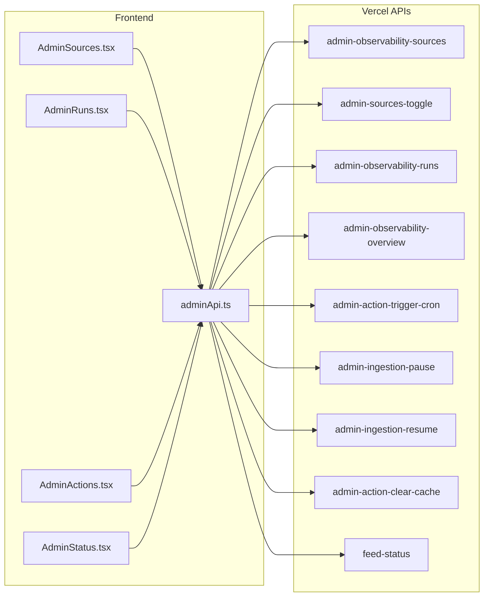

# Admin Pipeline UI

## Overview

Build an internal admin control panel for the content pipeline, adding 4 new pages under the existing `/admin` route structure. Uses existing APIs from Phase 8-9 and shadcn/ui components.

## Authentication Approach

Use `VITE_ADMIN_SECRET` environment variable. The admin API helper will send this as `x-admin-secret` header. In production, if the secret is not set or incorrect, API calls will fail with 401. This matches the existing pattern in [src/lib/invokeAdminFunction.ts](src/lib/invokeAdminFunction.ts).

## Files to Create

### 1. Admin API Client - [src/lib/adminApi.ts](src/lib/adminApi.ts)

A centralized API client for admin observability endpoints:

```typescript
// Wrapper for calling /api/admin-* endpoints
// Includes x-admin-secret header from VITE_ADMIN_SECRET
// Methods: getSources, toggleSource, getRuns, getOverview, 
//          triggerIngestion, pauseIngestion, resumeIngestion, clearCache
```


### 2. Admin Sources Page - [src/pages/AdminSources.tsx](src/pages/AdminSources.tsx)

Source Control Panel displaying all content sources with:

- Table with columns: name, source_key, status badge, last run, items created, toggle switch
- Status badges: Active (green), Disabled (gray), Error (red)
- Uses: `GET /api/admin-observability-sources`, `POST /api/admin-sources-toggle`

### 3. Admin Runs Page - [src/pages/AdminRuns.tsx](src/pages/AdminRuns.tsx)

Ingestion Runs table with:

- Columns: run_id, source, status, items_created, execution_time_ms, started_at, error (expandable)
- Filters by source and status using Select dropdowns
- Uses: `GET /api/admin-observability-runs`

### 4. Admin Actions Page - [src/pages/AdminActions.tsx](src/pages/AdminActions.tsx)

Manual controls with buttons:

- Trigger ingestion (all sources)
- Trigger ingestion (single source - with source selector)
- Pause ingestion
- Resume ingestion
- Clear feed cache
- Shows response summary inline after each action
- Uses: `POST /api/admin-action-trigger-cron`, `POST /api/admin-ingestion-pause`, `POST /api/admin-ingestion-resume`, `POST /api/admin-action-clear-cache`

### 5. Admin Status Page - [src/pages/AdminStatus.tsx](src/pages/AdminStatus.tsx)

Feed Health Snapshot with dashboard cards:

- Active sources count
- Last successful ingestion time
- Items created (last 24h)
- Feed freshness indicator
- Uses: `GET /api/feed-status`, `GET /api/admin-observability-overview`

## Files to Modify

### [src/App.tsx](src/App.tsx)

Add 4 new routes:

```typescript
<Route path="/admin/sources" element={<AdminSources />} />
<Route path="/admin/runs" element={<AdminRuns />} />
<Route path="/admin/actions" element={<AdminActions />} />
<Route path="/admin/status" element={<AdminStatus />} />
```


### [src/pages/Admin.tsx](src/pages/Admin.tsx)

Add navigation links to the new pages in the header section (alongside existing "View Feed" button). Use a simple nav bar or card links.

## UI Components to Use (from existing shadcn/ui)

- `Table` - for Sources and Runs pages
- `Card` - for Status dashboard cards
- `Badge` - for status indicators
- `Button` - for action buttons
- `Switch` - for source enable/disable toggle
- `Select` - for filters
- `Collapsible` or `Accordion` - for expandable error rows
- `Loader2` - for loading states

## Data Flow




## Success Criteria

- Open `/admin/status` to see pipeline health at a glance
- Open `/admin/sources` to see all sources with clear working/failing/disabled visual distinction
- Open `/admin/runs` to debug why specific ingestions failed