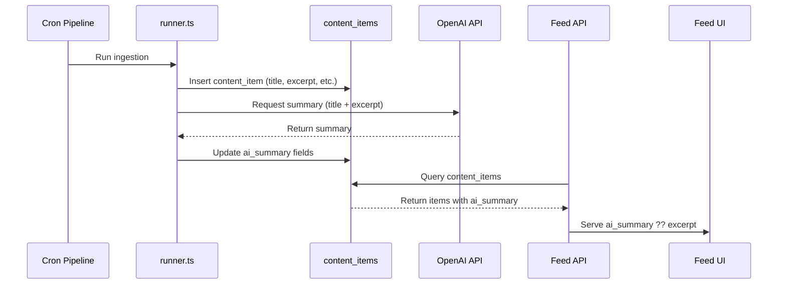

# AI Summary Enrichment Layer

This plan extends the existing cron ingestion pipeline to persist OpenAI-generated summaries into `content_items` and display them in the Feed.

## Architecture Overview



## 1. Database Migration

**File:** `supabase/migrations/20251220000000_add_ai_summary_fields.sql`

Add four nullable columns to `content_items`:

```sql
ALTER TABLE public.content_items
  ADD COLUMN IF NOT EXISTS ai_summary TEXT,
  ADD COLUMN IF NOT EXISTS ai_summary_model TEXT,
  ADD COLUMN IF NOT EXISTS ai_summary_generated_at TIMESTAMPTZ,
  ADD COLUMN IF NOT EXISTS ai_summary_length INTEGER;
```

- All columns are nullable (no destructive changes)
- Existing 604 rows remain valid
- Index on `ai_summary_generated_at` for observability queries

---

## 2. Cron Pipeline Changes

### 2.1 Create AI Summary Service

**New file:** `api/_internal/ingestion/ai-summary.ts`

Responsibilities:

- Call OpenAI API to generate summaries
- Enforce quality rules (2-4 paragraphs, no one-liners)
- Handle failures gracefully (return null, don't block ingestion)
- Log generation duration and token usage

Key functions:

- `generateAISummary(title: string, excerpt: string): Promise<AISummaryResult | null>`
- Uses `gpt-4o-mini` model (matching existing `ai-news-summary` edge function)
- Strict prompt: summarize only what's in the article, no hallucination

### 2.2 Update Runner

**File:** [`api/_internal/ingestion/runner.ts`](api/_internal/ingestion/runner.ts)

After successful `insertContentItem()` (line ~253-267):

```typescript
// Generate AI summary for newly created item
const summaryResult = await generateAISummary(item.title, item.excerpt ?? "");
if (summaryResult) {
  await updateContentItemAISummary(inserted.id, summaryResult);
}
```

Skip summarization if:

- Item already has `ai_summary` (idempotent)
- Source is marked `ai_generated = true` in config (from `content_sources.config`)

### 2.3 Update DB Types and Functions

**File:** [`api/_internal/ingestion/types.ts`](api/_internal/ingestion/types.ts)

Add new type:

```typescript
export interface AISummaryResult {
  summary: string;
  model: string;
  generatedAt: string;
  length: number;
}
```

**File:** [`api/_internal/ingestion/db.ts`](api/_internal/ingestion/db.ts)

Add function:

```typescript
export async function updateContentItemAISummary(
  itemId: string,
  result: AISummaryResult
): Promise<DbResult<{ id: string }>>
```

---

## 3. Feed API Changes

**File:** [`api/feed/content-items.ts`](api/feed/content-items.ts)

### 3.1 Add ai_summary to SELECT

Update the query (line ~121-136) to include:

```sql
ai_summary,
ai_summary_generated_at
```

### 3.2 Update Response Interface

Add to `ContentItemResponse`:

```typescript
ai_summary: string | null;
```

### 3.3 Map ai_summary in Response

In the transform (line ~155-179):

```typescript
ai_summary: item.ai_summary || null,
```

The Feed UI will display `ai_summary` if present, else fallback to `excerpt`. This is handled client-side in [`src/lib/feedData.ts`](src/lib/feedData.ts) `mapContentItemResponseToGist()`.

---

## 4. Feed Data Client Update

**File:** [`src/lib/feedData.ts`](src/lib/feedData.ts)

### 4.1 Update ContentItemResponse Interface

Add:

```typescript
ai_summary: string | null;
```

### 4.2 Update mapContentItemResponseToGist()

Change summary/context logic (line ~406-419):

```typescript
// Prefer AI summary, fallback to excerpt
const displayText = item.ai_summary || item.excerpt || "";
const summary = displayText.slice(0, 150) + (displayText.length > 150 ? "..." : "");
const context = displayText || "Fluxa content.";
```

---

## 5. Observability

### 5.1 Structured Logging in ai-summary.ts

Log entries for:

- `[AI Summary] Generated for item {id} in {duration}ms, length={chars}`
- `[AI Summary] Skipped for item {id}: {reason}` (already has summary, ai_generated source)
- `[AI Summary] Failed for item {id}: {error}`

### 5.2 Update content_runs Metadata

Extend `content_runs.metadata` to include:

```json
{
  "summaries_generated": 5,
  "summaries_skipped": 2,
  "summaries_failed": 1
}
```

### 5.3 Admin Observability

No changes needed to [`api/admin-observability-runs.ts`](api/admin-observability-runs.ts) - it already returns `metadata` field which will now include summary stats.

---

## 6. Cost Controls

- **Budget Check:** Respect existing `api_usage_budget` system (OpenAI calls tracked)
- **Skip AI-Generated:** Check `content_sources.config.ai_generated = true` before calling OpenAI
- **Model Choice:** Use `gpt-4o-mini` (~$0.15/1M input tokens) for cost efficiency
- **Rate Limiting:** Process summaries sequentially within each run (not parallel) to avoid rate limits

---

## 7. Summary Quality Prompt

```
You are a factual news summarizer. Summarize the following article in 2-4 short paragraphs.

Rules:
- Only include information that is explicitly stated in the article
- Do not add opinions, speculation, or external information
- Minimum 3 sentences, maximum 8 sentences
- Be informative and objective

Article Title: {title}
Article Content: {excerpt}
```

---

## Files Changed Summary

| File | Change |

|------|--------|

| `supabase/migrations/20251220000000_add_ai_summary_fields.sql` | New migration |

| `api/_internal/ingestion/ai-summary.ts` | New file - AI summary service |

| `api/_internal/ingestion/runner.ts` | Call AI summary after insert |

| `api/_internal/ingestion/db.ts` | Add updateContentItemAISummary() |

| `api/_internal/ingestion/types.ts` | Add AISummaryResult interface |

| `api/feed/content-items.ts` | Add ai_summary to query and response |

| `src/lib/feedData.ts` | Update interface and mapping logic |

---

## Validation Checklist

- [ ] Cron run inserts items with ai_summary populated
- [ ] Feed API returns ai_summary field
- [ ] Feed displays longer, informative summaries when available
- [ ] Falls back to excerpt when ai_summary is null
- [ ] CLI-triggered cron behaves same as scheduled cron
- [ ] No duplicate summarization (idempotent)
- [ ] Existing Feed items remain unaffected (backward compatible)
- [ ] Logs clearly explain why summary exists or doesn't